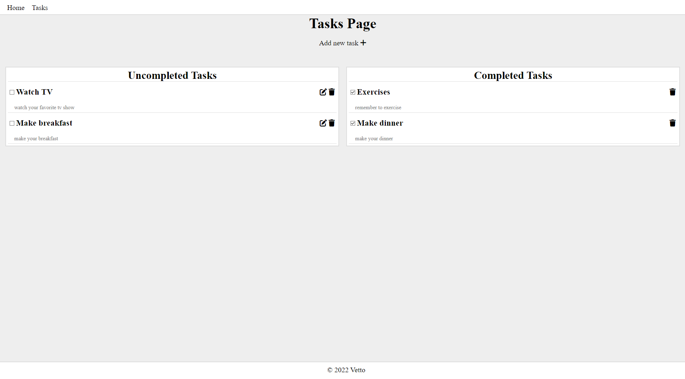
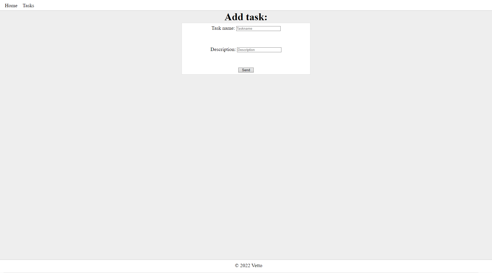
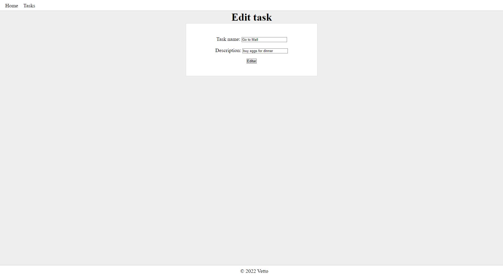
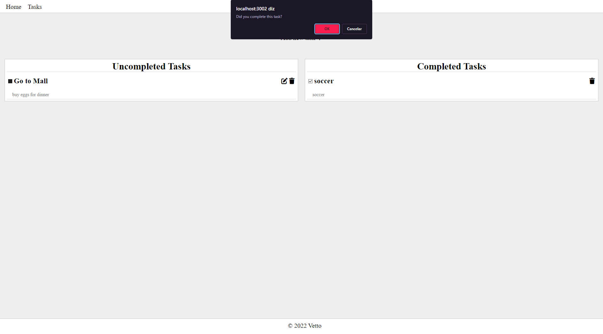
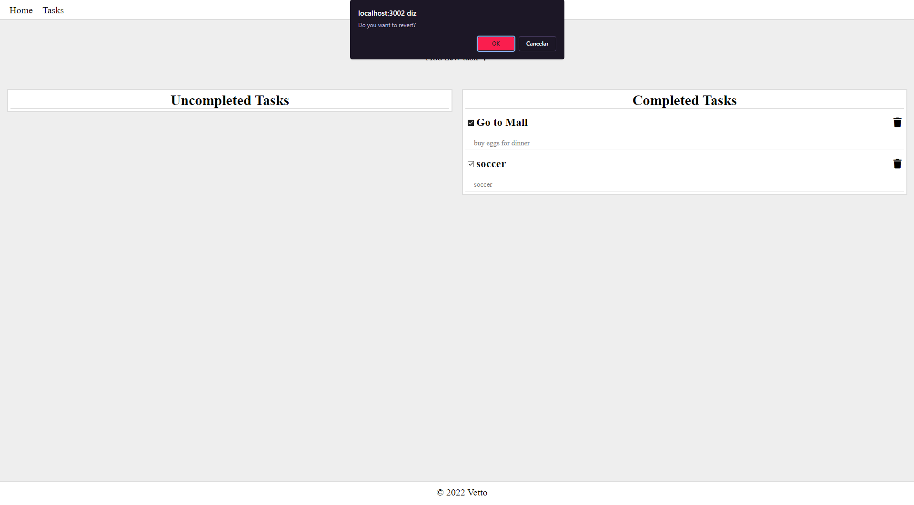
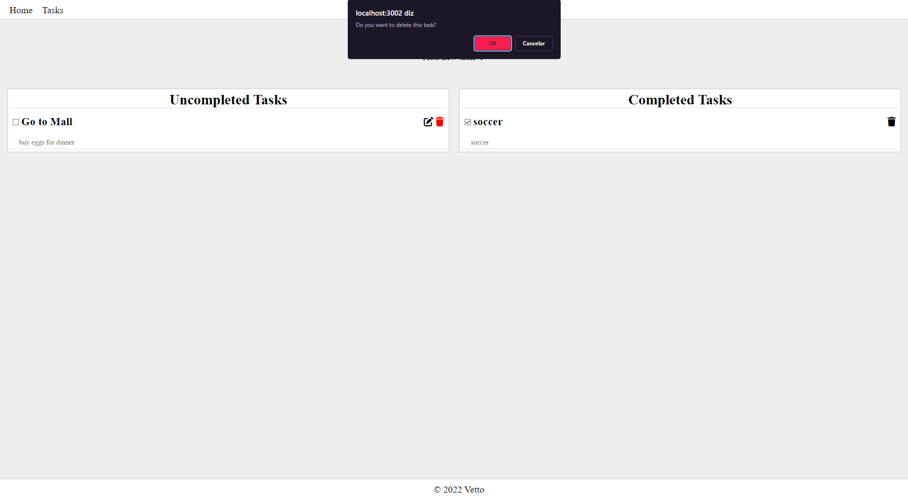

# Task Manager📌

It's a CRUD that you add/delete a task and save it in a SQL database

# Design









# Instructions

```bash
#Clone this repository
$ git clone https://github.com/VitorKaeZ/task_manager.git

#Install dependences
$ npm install

#Dependences
ejs
express
express-ejs-layouts
mysql

#Install db in your DBMS
mysql.sql
```
